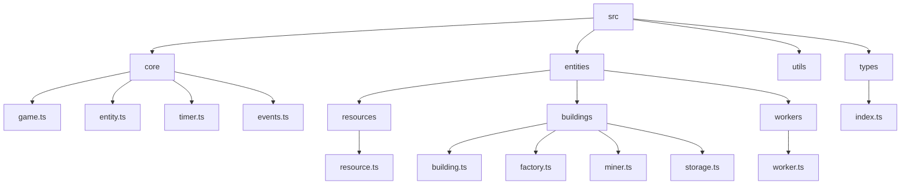

# **Product Requirements Document (PRD): Incrementa (Revised)**

## **1. Overview**

**Incrementa** is a JavaScript/TypeScript framework and toolkit for building web-based incremental (idle) games. Its mission is to empower developers to rapidly prototype and scale resource-gathering, automation, and upgrade-driven games using a clean, composable, and extensible API. Incrementa is designed for use with HTML/CSS frontends and is completely agnostic to rendering or game engine choices.

**Supported Game Types:**

* Idle/clicker games
* Resource management and gathering games
* Automation/progression games
* Factory and production chain games

---

## **2. Core Concepts**

### **<code>Game</code> (Orchestrator)**

* (New Section) A central `Game` class can act as the main orchestrator.
    * **Responsibilities:**
        * Manages the main game loop and the central `Timer`.
        * Holds collections of all active entities (`Resources`, `Buildings`, etc.).
        * Calls `update(deltaTime)` on active, updatable entities.
        * Manages global state or systems like an `UnlockManager` or `EventManager`.
        * Provides factory methods for creating entities (e.g., `game.createResource(...)`).
    * **Properties:** `entities`, `timer`, `isRunning`.
    * **Methods:** `start()`, `pause()`, `addEntity(entity)`, `removeEntity(entity)`, `update(deltaTime)`.

### **Entities**

* **<code>BaseEntity</code>**: Abstract base class for all game elements. Entities should have unique IDs. \

    * Properties:
        * `id: string` (Unique identifier, typically user-defined or generated with a helper utility)
        * `name: string`
        * `description: string` (Optional)
        * `isUnlocked: boolean` (Defaults to `false` or based on initial conditions)
        * `tags?: string[]` (Optional array for custom categorization and querying)
    * Lifecycle Hooks:
        * `onInitialize()`: Called once when the entity is created and added to the game.
        * `onUnlock()`: Called when `isUnlocked` transitions to `true`.
        * `onUpdate(deltaTime: number)`: Called on each game tick by the central `Timer` if the entity needs active updates.
    * Event Emitter:
        * `on(eventName: string, callback: Function)`: Registers an event listener.
        * `emit(eventName: string, data?: any)`: Emits an event to listeners. (e.g., `emit('stateChanged', { property: 'level', newValue: 2 })`)
* **<code>Resource</code>**: Represents a countable item in the game (e.g., gold, wood, energy). Resources themselves are typically passive; their amounts are changed by other entities or direct game actions. \

    * Properties:
        * `amount: number` (Current stored quantity, typically global for that resource type)
        * `basePassiveRate?: number` (Optional: a small, inherent generation rate, e.g. mana regen, defaults to 0)
    * Methods:
        * `increment(value: number)`: Increases the resource amount.
        * `decrement(value: number)`: Decreases the resource amount (with checks for non-negativity).
        * `setAmount(value: number)`: Directly sets the resource amount.
        * Emits events like `amountChanged` via its `BaseEntity` event emitter.
* **<code>Building</code> (Base Class for Structures)**: Shared logic for structures that are typically built by the player and can perform actions or grant benefits. \

    * Properties:
        * `cost: CostDefinition[]` (e.g., `[{ resource: woodResource, amount: 50 }, { resource: stoneResource, amount: 20 }]`)
        * `buildTime: number` (Time in seconds to complete construction)
        * `level: number` (Current level of the building, starting at 0 or 1)
        * `isBuilding: boolean` (Indicates if construction is in progress)
        * `upgradesApplied: Upgrade[]` (List of upgrades applied to this building)
    * Methods:
        * `startConstruction()`: Consumes resources defined in `cost` and starts a `Timer` or registers with the game's timer for `buildTime`.
        * `completeConstruction()`: Marks the building as constructed and ready.
        * `levelUp(levels?: number)`: Increases the building's level, potentially applying new costs and effects.
        * `applyUpgrade(upgrade: Upgrade)`: Applies an upgrade and recalculates relevant stats.
    * Lifecycle Hooks (beyond `BaseEntity`):
        * `onBuildStart()`
        * `onBuildComplete()`
        * `onLevelUp(newLevel: number)`
        * `onProductionTick?()`: If the building produces something passively on each tick.
* **<code>ProducerBuilding</code> (Base Class for Miners, Factories, etc.)**: Extends `Building`. Specialized for producing or transforming resources. \

    * Properties:
        * `productionCycleTime?: number` (Time in seconds for one production cycle, if applicable)
        * `output: ProductionOutput[]` (e.g., `[{ resource: ironResource, amount: 1 }]`)
        * `input?: ProductionInput[]` (e.g., `[{ resource: coalResource, amount: 2 }]`, for factories)
        * `operationalCostPerTick?: CostDefinition[]` (e.g. energy upkeep)
    * Methods:
        * `startProduction()`: Activates the producer.
        * `stopProduction()`: Deactivates the producer.
        * `canProduce(): boolean`: Checks if input resources are available and output storage has capacity.
        * (Internal) `_produce()`: Logic for consuming inputs and generating outputs. Called by `onUpdate` or by its own timer linked to `productionCycleTime`.
* **<code>Miner</code> (extends <code>ProducerBuilding</code>)**: Gathers a specific resource over time. \

    * Example Specific Properties:
        * `targetResource: Resource`
        * `gatherRatePerSecond: number` (Defines its `output`)
* **<code>Factory</code> (extends <code>ProducerBuilding</code>)**: Consumes input resources to produce output resources. \

    * Example Specific Properties: (Inputs and Outputs defined in `ProducerBuilding`)
        * `efficiency: number` (Modifier for production speed or resource use)
* **<code>Storage</code> (extends <code>BaseEntity</code>)**: Defines capacity limits for one or more resources. Assumes resource amounts are global and storage entities enforce caps. \

    * Properties:
        * `capacities: Map&lt;Resource, number>` (Defines max storable amount for specific resources)
    * Methods:
        * `getCapacityFor(resource: Resource): number | undefined`
        * `setCapacityFor(resource: Resource, amount: number)`
        * `hasCapacity(resource: Resource, amountToCheck: number): boolean`
    * Events:
        * `onCapacityReached(resource: Resource)`

### Timer

* Centralized timer utility or integrated within the `Game` object for all time-based activities. The primary game loop.
* Features:
    * Game-wide pause/resume (`game.pause()`, `game.resume()`).
    * Entities subscribe to game ticks via their `onUpdate(deltaTime)` method.
    * Callbacks for specific timed actions can be managed by individual entities or a dedicated `ActionScheduler` system.
        * `onTick(deltaTime: number)`: The main game loop tick accessible to entities.
    * Individual, short-term timers can still be instantiated for specific actions like build times if not directly managed by the game loop's delta time accumulation.

### UnlockCondition

* A function or a data structure defining conditions for an entity to become unlocked.
    * Example: `() => game.getResourceByName('gold').amount >= 100`
    * Example: `{ resource: 'gold', amount: 100, buildingLevel?: { buildingId: 'mine', level: 5 } }`
* Managed by an `UnlockManager` (part of `Game` or separate core module) that checks conditions periodically or on relevant game events.

### **<code>Upgrade</code> (potentially extends <code>BaseEntity</code>)**

* Enhancements that can be applied to entities (e.g., increase rates, reduce costs, unlock abilities).
    * Properties:
        * `name: string`
        * `description: string`
        * `cost: CostDefinition[]`
        * `effect: UpgradeEffectDefinition | ((targetEntity: BaseEntity, game: Game) => void)` (Data-driven or functional)
            * `UpgradeEffectDefinition`: e.g., `{ targetProperty: 'gatherRatePerSecond', operation: 'multiply', value: 1.2 }` or `{ targetProperty: 'output.0.amount', operation: 'add', value: 1 }`
        * `isRepeatable?: boolean`
        * `maxApplications?: number`
        * `unlockCondition?: UnlockCondition`
    * Methods:
        * `canPurchase(entityToUpgrade?: BaseEntity): boolean`
        * `apply(targetEntity: BaseEntity, game: Game)`: Modifies the target entity based on `effect`.
    * Events:
        * `onApplied(targetEntity: BaseEntity)`

---

## **3. Architecture**

* **OOP Design with Composition:** Entities inherit from common base classes, and complex behaviors are achieved by composing smaller, focused components or through interaction with core game systems.
* **Event-Driven:** Core interactions (resource changes, unlocks, build completions) should emit events, allowing other systems or the UI to react.
* **Modular Structure:**

    * `src/core/` (`game.ts`, `entity.ts`, `timer.ts`, `events.ts`, etc.)
    * `src/types/` (Shared type definitions, e.g., `index.ts`)


**Example File Structure:**



```text
src/
  core/
    game.ts
    entity.ts
    timer.ts
    events.ts
    // ...
  entities/
    resources/
      resource.ts
    buildings/
      building.ts
      factory.ts
      miner.ts
      storage.ts
    workers/
      worker.ts
  utils/
    index.ts
  types/
    index.ts

```

**Importing (User Perspective):**

```typescript
import { Game, Resource, Miner, Factory, Storage, Upgrade } from "incrementa";

// or for specific items

import { Miner } from "incrementa/entities/buildings/miner";

```

---

## **4. Developer Usage Examples**

### **Initializing the Game**

```typescript
// filepath: /Users/erickgoncalves/work/incrementa/docs/PRD.md
import { Game } from "incrementa";

const game = new Game();
```

### **Creating a Resource**

```typescript
// filepath: /Users/erickgoncalves/work/incrementa/docs/PRD.md
const gold = game.createResource({ // Assuming Game has factory methods
  id: "gold",
  name: "Gold",
  description: "A precious metal.",
  initialAmount: 50,
  basePassiveRate: 0.1 // Optional: e.g., 0.1 gold per second passively
});

gold.on('amountChanged', (eventData) => {
  console.log(`Gold amount is now: ${eventData.newAmount}`);
  // UI update logic here
});
```

### **Defining a Miner and Linking to Game Loop**

```typescript
// filepath: /Users/erickgoncalves/work/incrementa/docs/PRD.md
import { Miner } from "incrementa"; // Assuming Miner is a class developer can extend or use

// Define a specific type of Miner (or configure a generic one)
class IronMiner extends Miner {
  constructor(options) {
    super({
      ...options,
      output: [{ resource: game.getResourceById('iron'), amount: 1 }], // Assuming 'iron' resource exists
      productionCycleTime: 2, // Produces 1 iron every 2 seconds
    });
  }
}

const ironResource = game.createResource({ id: "iron", name: "Iron" });
const woodResource = game.createResource({ id: "wood", name: "Wood", initialAmount: 100 });

const miner = game.createEntity(IronMiner, { // Game factory method
  id: "ironMiner1",
  name: "Iron Miner Mk1",
  description: "Mines iron ore.",
  cost: [{ resource: woodResource, amount: 20 }],
  buildTime: 10, // seconds
  unlockCondition: () => gold.amount >= 10
});

// To start it after it's built and unlocked:
if (miner.isUnlocked && !miner.isBuilding) {
  miner.startProduction();
}

// The game.update(deltaTime) loop will call miner.onUpdate(deltaTime),
// which handles production logic based on productionCycleTime or gatherRatePerSecond.
```

### **Controlling Game Flow with Storage and Factory**

```typescript
// filepath: /Users/erickgoncalves/work/incrementa/docs/PRD.md
const ironStorage = game.createEntity(Storage, {
  id: "ironStorage1",
  name: "Iron Storage",
  capacities: new Map([[ironResource, 1000]]) // Store up to 1000 iron
});

ironStorage.on('capacityReached', (eventData) => {
  if (eventData.resource.id === 'iron') {
    console.warn("Iron storage is full!");
  }
});

class SteelFactory extends Factory {
  constructor(options) {
    super({
      ...options,
      input: [{ resource: ironResource, amount: 5 }],
      output: [{ resource: game.getResourceById('steel'), amount: 1 }], // Assuming 'steel' resource exists
      productionCycleTime: 5,
    });
  }
}

const steelResource = game.createResource({ id: "steel", name: "Steel" });

const factory = game.createEntity(SteelFactory, {
  id: "steelFactory1",
  name: "Steel Factory",
  cost: [{ resource: ironResource, amount: 50 }],
  buildTime: 30,
  unlockCondition: () => ironResource.amount >= 100 && miner.level >= 2
});

// To start it after it's built and unlocked:
if (factory.isUnlocked && !factory.isBuilding) {
  factory.startProduction(); // Production will occur if inputs are available and output has capacity
}

// Start the game loop
game.start();
```

---

## **5. Extensibility**

* **Custom Entities & Logic:** Developers can subclass `BaseEntity`, `Building`, `ProducerBuilding`, `Resource`, etc., to create highly custom game elements and override lifecycle hooks (`onInitialize`, `onUpdate`, `onUnlock`, `onBuildComplete`, etc.) or production logic.
* **Custom Conditions:** Unlock conditions and other conditional logic accept arbitrary functions, providing full control to the developer.
* **UI Bindings via Event System:** All `Entity` instances (and their derivatives) are intended to support a simple event emitter (`on`, `emit`). (Note: As of now, there is no dedicated `event-emitter.ts` file; event logic may be implemented within entities or in `events.ts`.) Developers can subscribe to events like `amountChanged` (for Resources), `buildComplete` (for Buildings), `unlocked`, `levelChanged`, etc., to update any frontend framework.

* **Lifecycle Hooks & Event-Driven Actions:**
    * `onInitialize()`, `onUnlock()`, `onUpdate(deltaTime)`
    * Building specific: `onBuildStart()`, `onBuildComplete()`, `onLevelUp()`
    * Producer specific: `onProductionTick()` (if continuous), or triggered by `onUpdate` based on `productionCycleTime`.
    * Generic entity events: `onPurchase()`, `onUpgradeApplied(upgradeDetails)`, `onStateChanged({ property, value })`.
    * Storage events: `onCapacityReached(resource)`.

---

## **6. Tech Stack**

* **Node.js** (for development, build processes, and potentially server-side logic if extended)
* **TypeScript** (for type safety and enhanced Developer Experience)
* **Frontend-agnostic:** No rendering or UI dependencies; designed to work with any HTML/CSS/JS frontend via its event system and state exposure.

---

## **7. Non-Goals**

* **Not a visual rendering engine or UI kit:** Incrementa provides game logic and state management, not UI components.
* **Core framework not responsible for persistence:** Saving and loading game state is considered a separate concern. A standard, pluggable Save/Load system is envisioned as a future addition or a first-party plugin.
* **Minimal external runtime dependencies:** Designed to be as "vanilla" TypeScript/JavaScript as possible to remain lightweight and avoid version conflicts.

---

## **8. Future Roadmap**

* **Plugin System:** Allow for custom extensions, such as different storage backends (localStoarge, API), analytics integration, or advanced automation plugins.
* **Standard Save/Load Plugin:** Provide an optional, easy-to-integrate plugin for common persistence needs (e.g., browser localStorage, JSON export/import).
* **Debug/Developer Tools:** Built-in utilities or a debug mode for easier inspection of game state, entity properties, event logs, and game balance tweaking.
* **More Pre-built Entity Types/Templates:** Expand the library with more common incremental game constructs.
* **Comprehensive Example Projects:** Showcase different types of games built with Incrementa.

---

*This PRD defines the vision, scope, and technical requirements for Incrementa. It is intended as a living document and should be updated as the project evolves.*